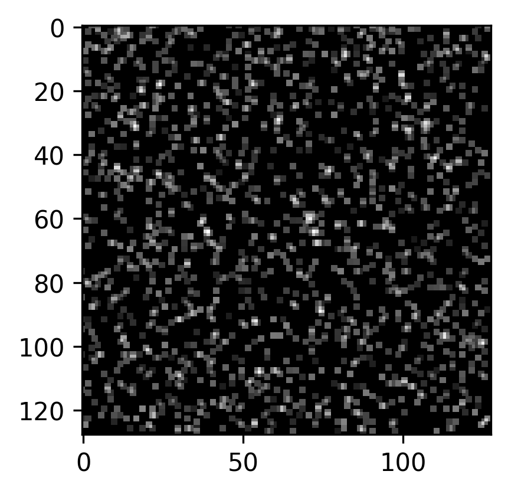

# Synthetic PIV image generation in Python

To install:

```
python -m pip install .
```


Minimal working example:

```python
from pypiv import Particle, Image

# Create particles with specific properties:
particles = Particle(1, 
                     size=(512,512), 
                     densities=(0.05,0.1),
                     diameters=(3,6),
                     distances=(1,1),
                     seeding_mode='random', 
                     random_seed=100)
                     
particles.seed_particles()

# Add particles to the image:
image = Image(particles)

image.add_particles()

image.add_gaussian_light_distribution(exposures=(0.02,0.8),
                                      maximum_intensity=2**16-1,
                                      laser_beam_thickness=2,
                                      laser_over_exposure=1,
                                      laser_beam_shape=0.85)

image.plot(0, 
           cmap='Greys_r',
           figsize=(6,6));

```

To obtain:

