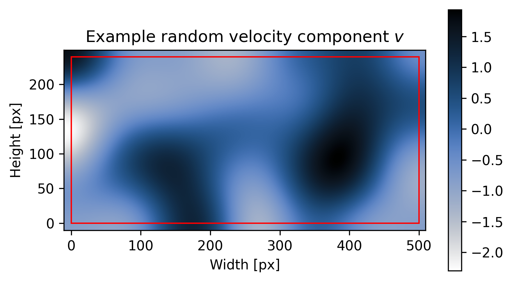

# Python PIV toolkit

<p align="center">
    
</p>

**Py**thon **ki**nematic **t**raining for particle image velocimetry (**PIV**)

## Introduction

**pykitPIV** is a Python package for synthetic PIV image generation.
The goal of this library is to give the user or a reinforcement learning (RL) agent a lot of flexibility in setting-up image generation.

The graph below shows the possible workflows constructed from the four main classes:

- The class **Particle** can be used to initialize particle properties and particle positions on an image.

- The class **FlowField** can be used to create velocity field to advect the particles.

- The class **Motion** takes an object of class **Particle** and applies an object of class **FlowField** to it to advect the particles and generate an image pair at time $t$ and $t + \Delta t$.

- The class **Image** is the endpoint of the workflow and can be used to apply laser and camera properties on any standalone image, as well as on a series of images of advected particles.

At each stage, the user can enforce reproducible image generation through fixing random seeds.

<p align="center">
    
</p>

## Installation

To install, run the following in the main ``pykitPIV`` directory:

```
python -m pip install .
```

## Unit tests

To run unit tests, run the following in the main ``pykitPIV`` directory:

```
python -m unittest discover -v
```

## Example PIV image

<p align="center">
    
</p>

## Example random velocity field

<p align="center">
    
</p>

<p align="center">
    
</p>

<p align="center">
    
</p>

## Example PIV image pair

> To be coded!
