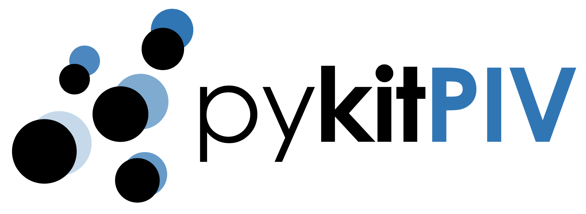

# Welcome to `pykitPIV`!

**Py**thon **ki**nematic **t**raining for particle image velocimetry (**PIV**)

<p align="center">
    
</p>

## Introduction

**pykitPIV** is a Python package for synthetic PIV image generation that exploits the kinematic relationship between two PIV images. The goal of this library is to give the user or a reinforcement learning (RL) agent a lot of flexibility in setting-up image generation. The generated image pairs and the associated flow targets can be directly used in training convolutional neural network (CNN) for flow estimation.

The graph below shows the possible workflows constructed from the four main classes:

- The class **Particle** can be used to initialize particle properties and particle positions on an image.

- The class **FlowField** can be used to create velocity field to advect the particles.

- The class **Motion** takes an object of class **Particle** and applies an object of class **FlowField** to it to advect the particles and generate an image pair at time $t$ and $t + \Delta t$.

- The class **Image** is the endpoint of the workflow and can be used to apply laser and camera properties on any standalone image, as well as on a series of images of advected particles.

At each stage, the user can enforce reproducible image generation through fixing random seeds.

<p align="center">
    
</p>

pykitPIV exploits the idea that if the time separation between two PIV images is small, kinematic relationship between particles is sufficient to determine particle displacement fields. For more information on kinematic training of convolutional neural networks (CNNs) using synthetic PIV images, please check the following references:

- [Kinematic training of convolutional neural networks for particle image velocimetry](https://iopscience.iop.org/article/10.1088/1361-6501/ac8fae/meta)

- [A lightweight neural network designed for fluid velocimetry](https://link.springer.com/article/10.1007/s00348-023-03695-8)

- [A lightweight convolutional neural network to reconstruct deformation in BOS recordings](https://link.springer.com/article/10.1007/s00348-023-03618-7)


## Installation

To install, run the following in the main ``pykitPIV`` directory:

```
python -m pip install .
```

## Unit tests

To run unit tests, run the following in the main ``pykitPIV`` directory:

```
python -m unittest discover -v
```

## Example PIV image pair

<p align="center">
    
</p>