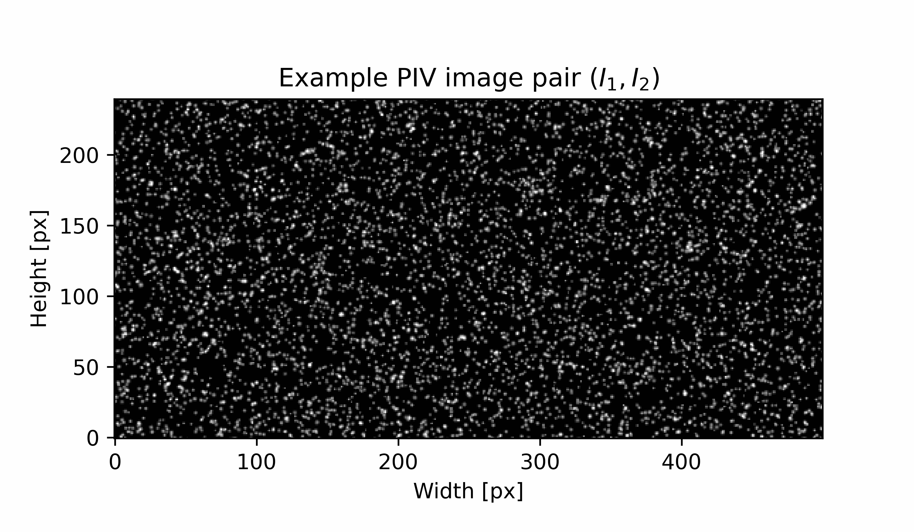

.. image:: images/pykitPIV-logo.png
  :width: 300

**pykitPIV** (**Py**\ thon **ki**\ nematic **t**\ raining for **P**\ article **I**\ mage **V**\ elocimetry) is a Python package for synthetic PIV image generation that exploits the kinematic relationship between two consecutive PIV images.

The generated image pairs and the associated flow targets can be directly used in training convolutional neural networks (CNNs) for flow estimation.
The PIV image processing is compatible with **PyTorch** and can easily port with convolutional layers (``torch.nn.Conv2d``) or with convolutional filters (``torch.nn.functional.conv2d``). The goal of this library is to give the user, or a machine learning algorithm, a lot of flexibility in setting-up image generation.

.. image:: images/pykitPIV-workflow.svg
  :width: 900
  :align: center

The graph above shows the possible workflows constructed from the five main classes:

- The class **Particle** can be used to initialize particle properties and particle positions on an image.

- The class **FlowField** can be used to create a velocity field to advect the particles.

- The class **Motion** takes an object of class **Particle** and applies an object of class **FlowField** to it to
  advect the particles and generate an image pair, :math:`\mathbf{I} = (I_1, I_2)^{\top}`, at time :math:`t` and
  :math:`t + T` respectively. Here :math:`T` denotes the time separation between two PIV images.

- The class **Image** can be used to apply laser and camera properties on any standalone image, as well as on a series of images of advected particles.

- The class **Postprocess** is the endpoint of the workflow and can be used to postprocess a single image or a series of images.

At each stage, the user can enforce reproducible image generation through fixing random seeds.

**pykitPIV** exploits the idea that if the time separation between two PIV images is small,
kinematic relationship between particles is sufficient to determine particle displacement fields.
For more information on kinematic training of convolutional neural networks (CNNs) using synthetic PIV images, please
check the following references:

- `Kinematic training of convolutional neural networks for particle image velocimetry <https://iopscience.iop.org/article/10.1088/1361-6501/ac8fae/meta>`_

- `A lightweight neural network designed for fluid velocimetry <https://link.springer.com/article/10.1007/s00348-023-03695-8>`_

- `A lightweight convolutional neural network to reconstruct deformation in BOS recordings <https://link.springer.com/article/10.1007/s00348-023-03618-7>`_

------------------------------------------------------------------------------------------------------------------------

.. toctree::
   :maxdepth: 5
   :caption: User Guide

   user/particle
   user/flowfield
   user/motion
   user/image
   user/postprocess

.. toctree::
   :maxdepth: 2
   :caption: Tutorials & Demos

   tutorials/demo-generate-images
   tutorials/demo-generate-pytorch-dataset
   tutorials/demo-import-external-velocity-field
   tutorials/demo-image-statistics
   tutorials/demo-integrate-with-LIMA

