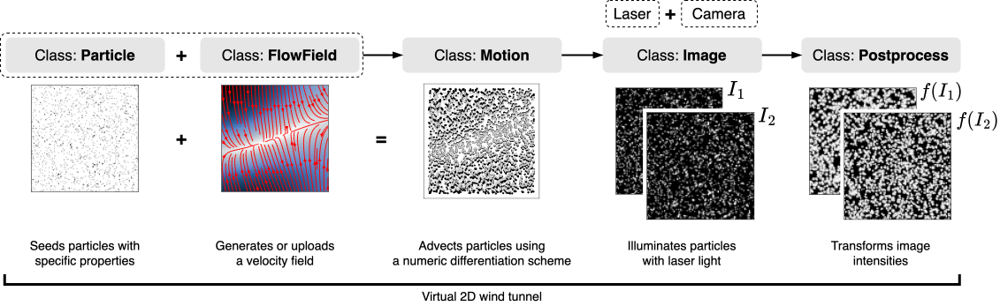

######################################
Virtual wind tunnel with **pykitPIV**
######################################

The graph below shows the five main classes of **pykitPIV** which allow for building a 2D virtual wind tunnel:

- The class **Particle** can be used to initialize particle properties and particle positions on an image.

- The class **FlowField** can be used to create a velocity field to advect the particles.
  It is also used to set the time separation between images and compute displacement fields.
  A variety of challenging flow fields can be generated with this class.

- The class **Motion** takes an object of class **Particle** and applies an object of class **FlowField** to it to
  advect the particles.

- The class **Image** can be used to apply laser and camera properties on any standalone image, as well as on a series of images of advected particles.
  This class essentially generates an image pair tensor, :math:`\mathbf{I} = (I_1, I_2)^{\top}`, at time :math:`t_1` and
  :math:`t_2 = t_1 + \Delta t` respectively, where :math:`\Delta t` denotes the time separation between two images.

- The class **Postprocess** can be used to postprocess a single image or a series of images.

At each stage, the user can enforce reproducible image generation through fixing random seeds.
