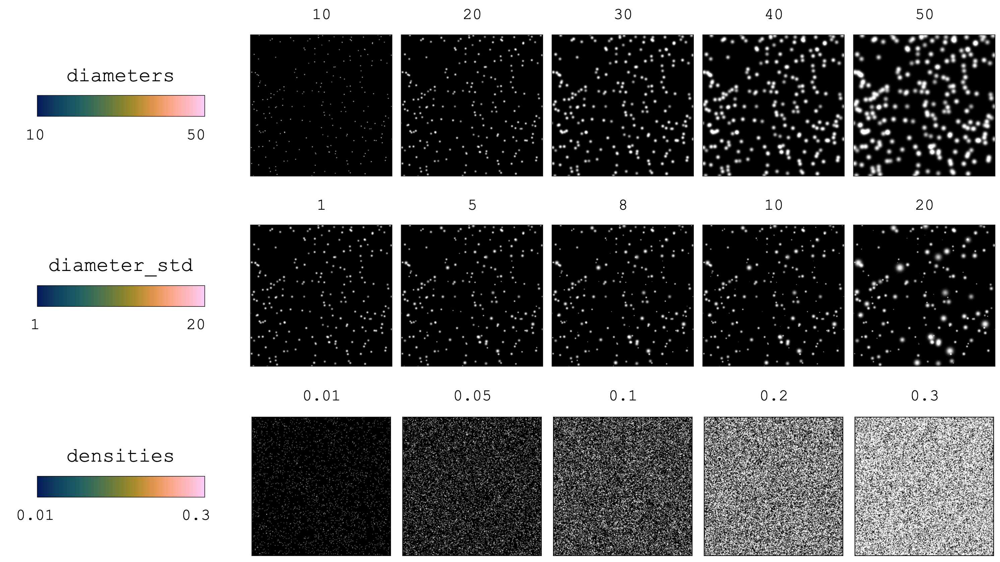

######################################
Image generation parameters cheatsheet
######################################

Here, we demonstrate visually how different image generation parameters affect the PIV images to
present the variety of conditions that can be generated.
Below, we use images that are :math:`512 \text{px} \times 512 \text{px}`.

************************************************************
Class: ``Particle``
************************************************************

