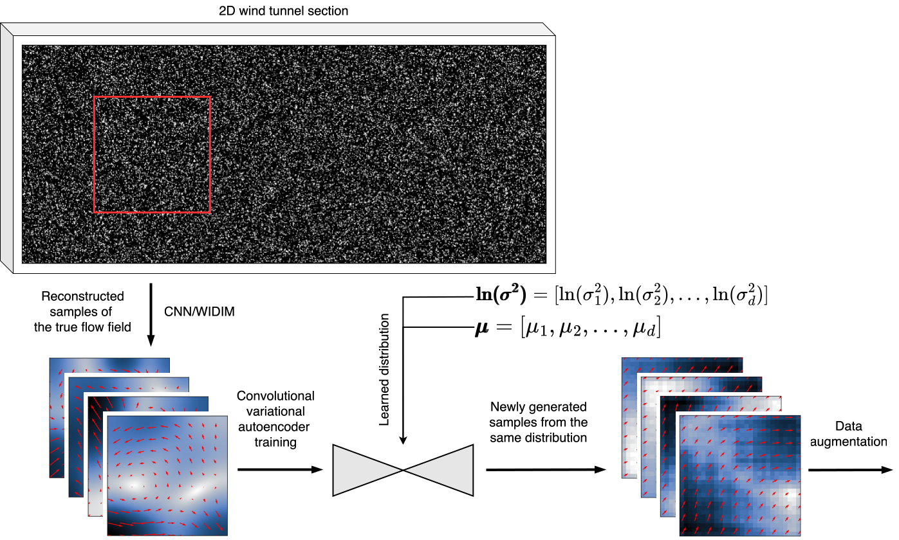

######################################
A gallery of examples
######################################

Virtual PIV with a compressible/incompressible flow
==================================================================

You can find the complete tutorial here: `demo-pykitPIV-07-generate-temporal-sequence-of-images.ipynb <https://pykitpiv.readthedocs.io/en/latest/tutorials/demo-07-generate-temporal-sequence.html>`_.

Below, we show two flow cases:

- a compressible flow, where :math:`\nabla \cdot \vec{\mathbf{V}} \neq 0`
- an incompressible (potential) flow, where :math:`\nabla \cdot \vec{\mathbf{V}} = 0`

Notably, the compressible flow leads to clustering of particles in the regions of strongest divergence,
while the incompressible flow, having zero divergence, cannot lead to clustering of particles.

.. image:: ../images/animate-compressible-PIV.gif
    :width: 700
    :align: center

.. image:: ../images/animate-incompressible-PIV.gif
    :width: 700
    :align: center

------

Virtual PIV environment for reinforcement learning
==================================================================

You can find the complete tutorial here: `demo-pykitPIV-13-SingleDQN-RL-find-sources-and-sinks.ipynb <https://pykitpiv.readthedocs.io/en/latest/tutorials/demo-13-SingleDQN.html>`_.

The functionalities from the machine learning module can be used to train a reinforcement learning (RL)
agent to navigate the virtual PIV camera towards sources/sinks in a radial flow. The agent can perform one of the five actions:

- Move up
- Move down
- Move right
- Move left
- Stay

on the virtual camera, thereby with each step it moves the virtual PIV camera in 2D by :math:`N` pixels.

.. image:: ../images/PIVEnv.svg
    :width: 800
    :align: center

------

Variational-generative approach for creating new training samples
==================================================================

You can find the complete tutorial here: `demo-pykitPIV-21-convolutional-variational-autoencoder.ipynb <https://pykitpiv.readthedocs.io/en/latest/tutorials/demo-21-CVAE.html>`_.

The functionalities from the machine learning module can be used to train a convolutional variational autoencoder (CVAE).
The trained CVAE model generates new velocity fields (:math:`u` and :math:`v` components) that belong to the distribution of some experimental data.
New PIV snapshots can then be generated with the newly generated velocity fields.
Hence, this approach can be used to extend the training data for transfer learning and can help adapt a machine learning model to the changing experimental conditions.
Potentially, the simplified Langevin model (SLM) can be added atop the generated flow field samples
to mitigate the smoothing effect that the variational autoencoder has.

