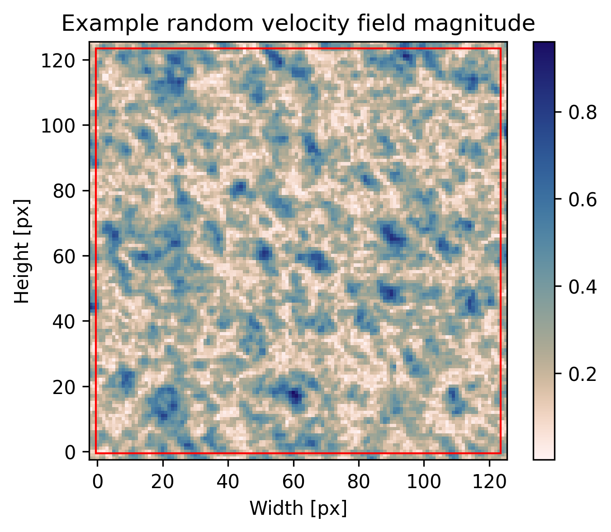
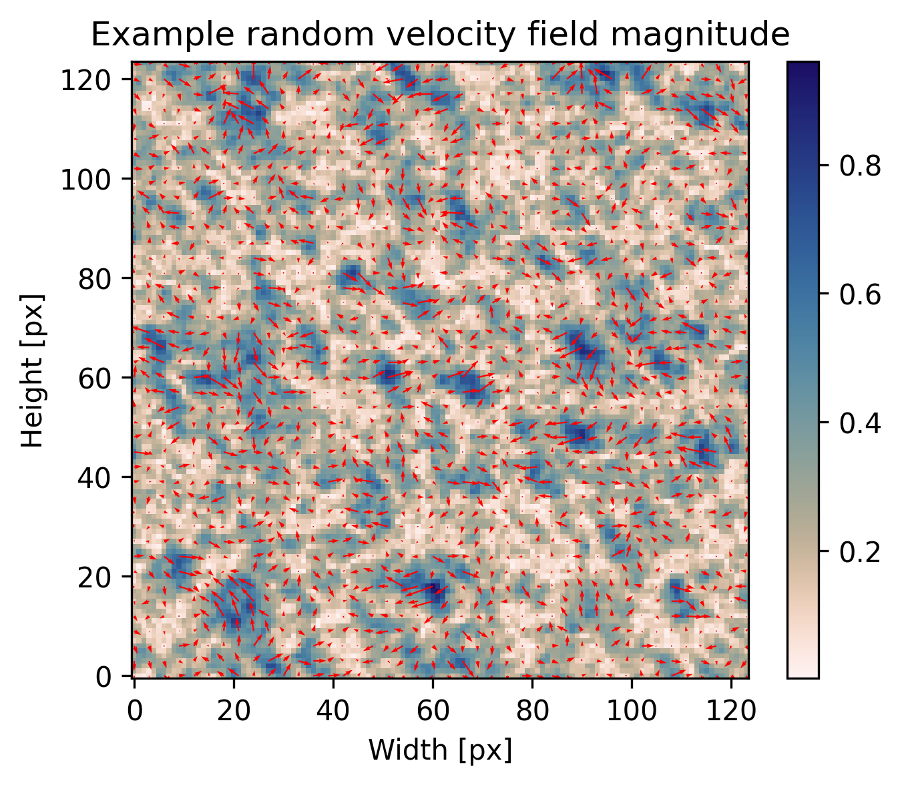
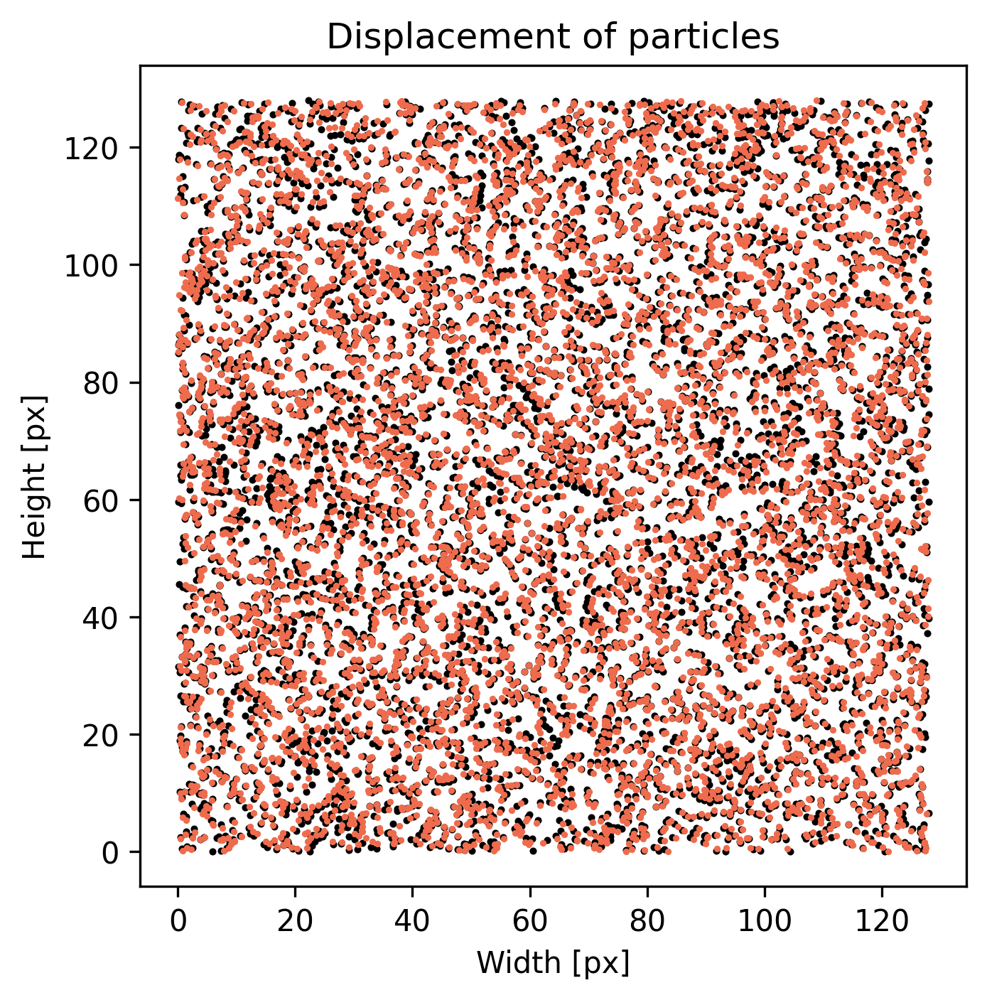
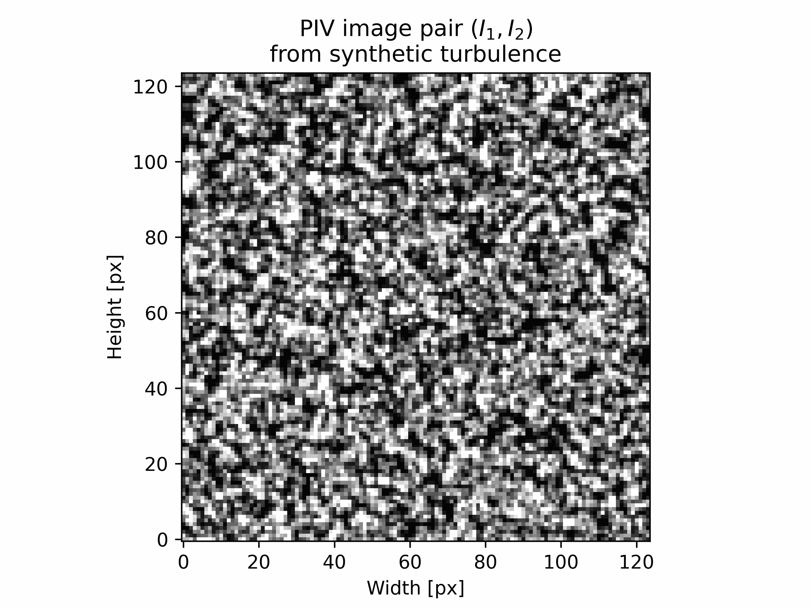

######################################
Upload external velocity field
######################################

************************************************************
Introduction
************************************************************

In this tutorial, we are going to generate a velocity field using the `synthetic turbulence generator <https://turbulence.utah.edu/>`_ and upload it into the ``FlowField`` class.

We use the von Karman-Pao spectrum to generate an isotropic synthetic turbulent velocity field.

.. code:: python

    import numpy as np
    import pandas as pd
    import cmcrameri.cm as cmc
    from pykitPIV import Particle, FlowField, Motion, Image

.. code:: python

    n_images = 1
    image_size = (124,124)
    size_buffer = 2
    figsize = (5,4)

************************************************************
Generate particles with specific properties
************************************************************

.. code:: python
    
    particles = Particle(n_images, 
                         size=image_size, 
                         size_buffer=size_buffer,
                         diameters=(2,3),
                         distances=(1,2),
                         densities=(0.4,0.41),
                         signal_to_noise=(5,20),
                         diameter_std=0.5,
                         seeding_mode='random', 
                         random_seed=100)

.. code:: python

    image = Image(random_seed=100)

.. code:: python

    image.add_particles(particles)

************************************************************
Upload flow field generated with synthetic turbulence
************************************************************

.. code:: python

    flowfield = FlowField(n_images,
                          size=image_size,
                          size_buffer=size_buffer)

.. code:: python

    grid_size = 128
    n_modes = 100

.. code:: python
    
    u_df = pd.read_csv('u_n' + str(grid_size) + '_m' + str(n_modes) + '.txt', sep = ',', header=1).to_numpy()
    v_df = pd.read_csv('v_n' + str(grid_size) + '_m' + str(n_modes) + '.txt', sep = ',', header=1).to_numpy()
    w_df = pd.read_csv('w_n' + str(grid_size) + '_m' + str(n_modes) + '.txt', sep = ',', header=1).to_numpy()
    
    u_tensor = np.reshape(u_df, (grid_size,grid_size,grid_size))
    v_tensor = np.reshape(v_df, (grid_size,grid_size,grid_size))
    w_tensor = np.reshape(w_df, (grid_size,grid_size,grid_size))

.. code:: python

    synth_turb_gen_velocity_field = (u_tensor, v_tensor)

.. code:: python

    flowfield.upload_velocity_field(synth_turb_gen_velocity_field)

.. code:: python

    image.add_flowfield(flowfield)

.. code:: python

    image.plot_velocity_field_magnitude(0,
                                        with_buffer=True,
                                        xlabel='Width [px]',
                                        ylabel='Height [px]',
                                        title='Example random velocity field magnitude',
                                        cmap=cmc.lapaz_r,
                                        figsize=figsize, 
                                        filename='synthetic-turbulence-demo-velocity-field-magnitude.png');

.. code:: python
    
    image.plot_velocity_field_magnitude(0,
                                        with_buffer=False,
                                        add_quiver=True,
                                        quiver_step=3,
                                        quiver_color='r',
                                        xlabel='Width [px]',
                                        ylabel='Height [px]',
                                        title='Example random velocity field magnitude',
                                        cmap=cmc.lapaz_r,
                                        figsize=figsize,
                                        filename='synthetic-turbulence-demo-velocity-field-magnitude-quiver.png');

************************************************************
Add movement to particles
************************************************************

.. code:: python
    
    motion = Motion(particles, 
                    flowfield, 
                    time_separation=2)

.. code:: python

    motion.runge_kutta_4th(n_steps=10)

.. code:: python
    
    motion.plot_particle_motion(0,
                                xlabel='Width [px]',
                                ylabel='Height [px]',
                                title='Displacement of particles',
                                figsize=(5,5),
                                filename='synthetic-turbulence-demo-displacement.png');

************************************************************
Visualize the PIV image pair
************************************************************

.. code:: python

    image.add_motion(motion)

.. code:: python
    
    image.add_reflected_light(exposures=(0.6,0.65),
                              maximum_intensity=2**16-1,
                              laser_beam_thickness=1,
                              laser_over_exposure=1,
                              laser_beam_shape=0.95,
                              alpha=1/10)

.. code:: python
    
    image.plot_image_pair(0,
                          with_buffer=False, 
                          xlabel='Width [px]',
                          ylabel='Height [px]',
                          title='PIV image pair $(I_1, I_2)$\nfrom synthetic turbulence',
                          cmap='Greys_r',
                          figsize=(6,4.5), 
                          dpi=600,
                          filename='synthetic-turbulence-demo-PIV-image-I1-I2.gif');

