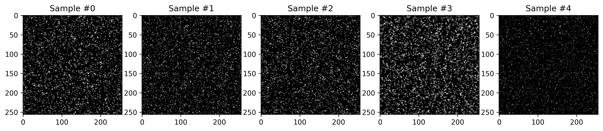

############################################################################################
Create a **PyTorch** data loader
############################################################################################

************************************************************
Introduction
************************************************************

In this tutorial, we create a **PyTorch**-compatible data loader for **pykitPIV**-generated PIV images
that can be readily used for training ML algorithms. We use the ``PIVDataset`` class from the ``ml`` module
which is a subclass of **PyTorch**'s ``torch.utils.data.Dataset``.
We then use **PyTorch**'s ``torch.utils.data.DataLoader`` to handle loading training and testing samples.
You can learn more about the methodology of using datasets and data loaders
`in this PyTorch documentation <https://pytorch.org/tutorials/beginner/basics/data_tutorial.html>`_.

************************************************************
The ``PIVDataset`` class
************************************************************

**pykitPIV** provides the ``PIVDataset`` class that is a subclass of the ``torch.utils.data.Dataset`` class.
It implements three standard methods: ``__init__``, ``__len__``, and ``__getitem__``. Below, we present the content
of this class which can be readily accessed from the ``ml`` module:

.. code:: python

    class PIVDataset(Dataset):

        def __init__(self, dataset, transform=None):

            if isinstance(dataset, str):

                # Upload the dataset:
                f = h5py.File(dataset, "r")

                # Access image intensities:
                self.data = np.array(f["I"]).astype("float32")

                # Access flow targets:
                self.target = np.array(f["targets"]).astype("float32")

            elif isinstance(dataset, dict):

                # Access image intensities:
                self.data = np.array(dataset["I"]).astype("float32")

                # Access flow targets:
                self.target = np.array(dataset["targets"]).astype("float32")

            # Multiply the v-component of velocity by -1:
            self.target[:,1,:,:] = -self.target[:,1,:,:]

            if isinstance(dataset, str): f.close()

            # Allow for any custom data transforms to be used later:
            self.transform = transform

        def __len__(self):

            return len(self.data)

        def __getitem__(self, idx):

            # Get the sample:
            sample = self.data[idx], self.target[idx]

            # Apply any custom data transforms on this sample:
            if self.transform:
                sample = self.transform(sample)

        return sample

.. warning::

    **pykitPIV**'s PIV images, and the associated targets, are generated assuming that the origin of the coordinate
    system is the lower-left corner (equivalent to setting ``origin='lower'`` in ``plt.imshow()``).
    The *bottom* boundary of a PIV image corresponds to ``[0,:]`` rows from the raw ``numpy`` arrays that store, *e.g.*, the image intensities
    or the velocity components.
    The *top* boundary of a PIV image corresponds to ``[-1,:]`` rows from the raw ``numpy`` arrays.

    Whenever the PIV images need to be interpreted with the origin in the upper-left corner
    (equivalent to setting ``origin='upper'`` in ``plt.imshow``), the :math:`v`-component of velocity has to be multiplied by :math:`-1`.
    This is the case when using the generated **pykitPIV** dataset as raw ``numpy`` arrays, such as in an input/output
    to a convolutional neural network (CNN). A CNN processes arrays assuming that the *top* boundary is ``[0,:]`` and the *bottom*
    boundary is ``[-1,:]``. With this flip, the :math:`v`-component of velocity has to swap sign, such that whatever was a positive
    :math:`v`-component (from the old *bottom* to *top*) now is a negative :math:`v`-component (from the new *top* to *bottom*).

    This preserves the effect (divergence or convergence) that the :math:`v`-component of velocity has on the particles.

    .. image:: ../images/pykitPIV-dataloader-warning.svg
        :width: 700
        :align: center

*************************************************************************
Create **PyTorch**-compatible data loaders for **pykitPIV** images
*************************************************************************

Upload the **pykitPIV**-generated images
-------------------------------------------------

.. code:: python

    import numpy as np
    import h5py
    from torch.utils.data import DataLoader
    from torchvision import transforms
    import matplotlib.pyplot as plt
    from pykitPIV.ml import PIVDataset

We assume that the PIV/BOS images have been saved and are stored under the following ``path``:

.. code:: python

    path = '../docs/data/pykitPIV-dataset-10-PIV-pairs-256-by-256.h5'

If you don't have the desired PIV/BOS dataset yet, you can use the generic script,
``/scripts/pykitPIV-generate-images.py``, and run it with, e.g.:

.. code-block:: bash

    python pykitPIV-generate-images.py --n_images 10 --size_buffer 10 --image_height 256 --image_width 256

Load and store **pykitPIV** images
-------------------------------------------------

We instantiate an object of the ``PIVDataset`` class:

.. code:: python

    PIV_data = PIVDataset(dataset=path)

Thanks to the ``__len__`` method, we can now execute the ``len()`` command on the object:

.. code:: python

    len(PIV_data)

This will return the total number of PIV image pairs in the uploaded dataset:

.. code-block:: text

    10

Thanks to the ``__getitem__`` method, we can access the data sample at a given index:

.. code:: python

    (I, target) = PIV_data[2]

or, at multiple indices:

.. code:: python

    (I, target) = PIV_data[2:7]

You can use the indexing to visualize the first few samples from the dataset:

.. code:: python

    n_samples = 5

.. code:: python

    fig = plt.figure(figsize=(n_samples*3, 5))
    spec = fig.add_gridspec(ncols=n_samples,
                            nrows=1,
                            width_ratios=[1 for i in range(0,n_samples)],
                            height_ratios=[1])

    for i in range(0,n_samples):

        I, target = PIV_data[i]

        f = fig.add_subplot(spec[0,i])
        plt.imshow(I[0,:,:], cmap='Greys_r')
        plt.title('Sample #' + str(i))

    plt.savefig('PIV-samples.png', dpi=300, bbox_inches='tight')

Create a ``torch.utils.data.DataLoader`` with train and test samples
----------------------------------------------------------------------------

First, we allow the user to create custom composition of data transforms that will augment the
train and test datasets. For more information on data transforms check this link
`this link <https://pytorch.org/vision/stable/transforms.html>`_.

.. code:: python

    # Create a custom composition of data transforms to augment the training datasets:
    transform = transforms.Compose([transforms.ToTensor()])

Next, we create train and test datasets using an instance of ``PIVDataset`` for each.

The first method assumes that you have a separate file for the train and test samples:

.. code:: python

    path_train = '../docs/data/pykitPIV-dataset-10-PIV-pairs-256-by-256-train.h5'
    path_test = '../docs/data/pykitPIV-dataset-10-PIV-pairs-256-by-256-test.h5'

therefore, you can create:

.. code:: python

    train_dataset = PIVDataset(dataset=path_train, transform=transform)
    test_dataset = PIVDataset(dataset=path_test, transform=transform)

The second method is to upload the dataset dictionary directly, assuming that you have one containing training and
one containing testing samples. This gives the user a chance for a more flexible train/test split. Note that the
dictionary has to store image intensities under the key ``"I"`` and image targets under the key ``"targets"``.

.. code:: python

    dataset_train = {"I" : ... ,
                     "targets" : ...}
    dataset_test = {"I" : ... ,
                    "targets" : ...}

In an analogous way, you can create:

.. code:: python

    train_dataset = PIVDataset(dataset=dataset_train, transform=transform)
    test_dataset = PIVDataset(dataset=dataset_test, transform=transform)

Finally, we create **PyTorch** data loaders for train and test samples. There, we have the option to specify
various mini-batching parameters such as the the batch size.
You can check all the available arguments of ``torch.utils.data.DataLoader``
`here <https://pytorch.org/docs/stable/data.html#torch.utils.data.DataLoader>`_.

.. code:: python

    train_loader = DataLoader(train_dataset,
                              batch_size=4,
                              shuffle=True)

    test_loader = DataLoader(test_dataset,
                             batch_size=4,
                             shuffle=True)