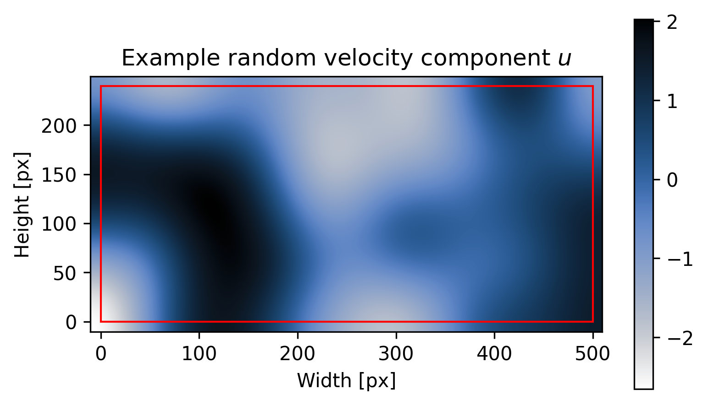
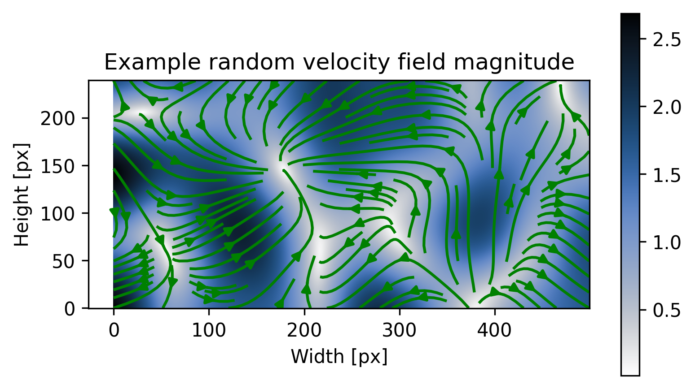
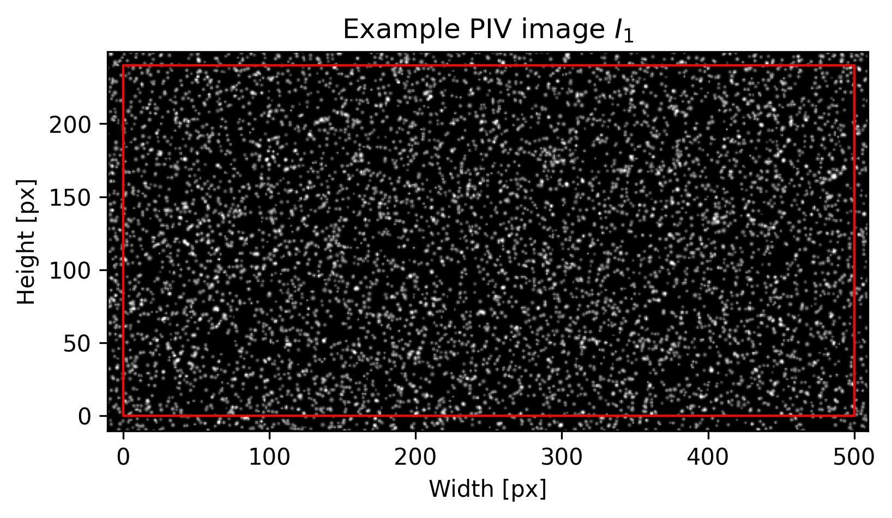

######################################
Generate synthetic images
######################################

************************************************************
Introduction
************************************************************

This tutorial presents a minimal working example for generating PIV image pairs.

.. code:: python

    import numpy as np
    import cmcrameri.cm as cmc
    from pykitPIV import Particle, FlowField, Motion, Image

Specify the number of image pairs to generate:

.. code:: python

    n_images = 1

Define image sizes in pixels:

.. code:: python

    image_size = (240,500)

This tuple defines the proper PIV image area, in this case :math:`(240 \text{px} \times 500 \text{px})`.

Specify the buffer in pixels for the image size:

.. code:: python

    size_buffer = 10

With buffer equal to :math:`10 \text{px}`, the total PIV image area is :math:`(260 \text{px} \times 520 \text{px})` in this case.

Buffer should always be added to images to allow particles to exit or enter the proper PIV image area without creating
spurious disappearance of particles close to image edge. At any stage of plotting PIV images, the user can decide to
visualize with buffer (``with_buffer=True``) or without buffer (``with_buffer=False``). When ``with_buffer=True``,
the buffer outline is marked with the red rectangle.

Specify the figure sizes for all plotted images:

.. code:: python

    figsize = (10,5)

************************************************************
Generate particles with specific properties
************************************************************

Instantiate an object of the ``Particle`` class that defines particles with specific properties, and seed the particles randomly:

.. code:: python

    particles = Particle(n_images,
                         size=image_size,
                         size_buffer=size_buffer,
                         diameters=(2,4),
                         distances=(1,2),
                         densities=(0.05,0.1),
                         signal_to_noise=(5,20),
                         diameter_std=0.5,
                         seeding_mode='random',
                         random_seed=100)

Instantiate an object of the ``Image`` class that defines the image space:

.. code:: python

    image = Image(random_seed=100)

Add generated particles to the image:

.. code:: python

    image.add_particles(particles)

If we plot the image at this stage, we will only see the particle locations (attached to pixel centroids):

.. code:: python

    image.plot(0,
               with_buffer=True,
               xlabel='Width [px]',
               ylabel='Height [px]',
               title='Particle positions',
               cmap='Greys',
               figsize=figsize,
               filename='particle-positions.png');

.. image:: ../images/particle-positions.png
    :width: 700
    :align: center

We can now add laser light reflected from the particles:

.. code:: python

    image.add_reflected_light(exposures=(0.01,0.8),
                              maximum_intensity=2**16-1,
                              laser_beam_thickness=1,
                              laser_over_exposure=1,
                              laser_beam_shape=0.95,
                              alpha=1/20)

Which produces the PIV image :math:`I_1`:

.. code:: python

    image.plot(0,
               with_buffer=True,
               xlabel='Width [px]',
               ylabel='Height [px]',
               title='Example PIV image',
               cmap='Greys_r',
               figsize=figsize,
               filename='example-image.png');

.. image:: ../images/example-image.png
    :width: 700
    :align: center

************************************************************
Generate random velocity field to advect the particles
************************************************************

Instantiate an object of the ``FlowField`` class that defines the random velocity field:

.. code:: python

    flowfield = FlowField(n_images,
                          size=image_size,
                          size_buffer=size_buffer,
                          flow_mode='random',
                          gaussian_filters=(10,11),
                          n_gaussian_filter_iter=20,
                          sin_period=(30,300),
                          displacement=(0,10),
                          random_seed=100)

Add generated flow field to the image:

.. code:: python

    image.add_velocity_field(flowfield)

At this point, the ``Image`` class can help us visualize the generated velocity field.

We can visualize each velocity component:

.. code:: python

    image.plot_velocity_field(0,
                              with_buffer=True,
                              xlabel='Width [px]',
                              ylabel='Height [px]',
                              title=('Example random velocity component $u$', 'Example random velocity component $v$'),
                              cmap=cmc.oslo_r,
                              figsize=figsize,
                              filename='example-random-velocity-field.png');

.. image:: ../images/example-random-velocity-field-v.png
    :width: 700
    :align: center

We can also visualize the velocity magnitude:

.. code:: python

    image.plot_velocity_field_magnitude(0,
                                        with_buffer=True,
                                        xlabel='Width [px]',
                                        ylabel='Height [px]',
                                        title='Example random velocity field magnitude',
                                        cmap=cmc.oslo_r,
                                        figsize=figsize,
                                        filename='example-random-velocity-field-magnitude.png');

Optionally, a quiver plot or a streamplot can be added on top of the velocity magnitude field:

.. code:: python

    image.plot_velocity_field_magnitude(0,
                                        with_buffer=False,
                                        add_quiver=True,
                                        quiver_step=10,
                                        quiver_color='r',
                                        xlabel='Width [px]',
                                        ylabel='Height [px]',
                                        title='Example random velocity field magnitude',
                                        cmap=cmc.oslo_r,
                                        figsize=figsize,
                                        filename='example-random-velocity-field-magnitude-quiver.png');

.. code:: python

    image.plot_velocity_field_magnitude(0,
                                        with_buffer=False,
                                        add_streamplot=True,
                                        streamplot_density=1,
                                        streamplot_color='g',
                                        xlabel='Width [px]',
                                        ylabel='Height [px]',
                                        title='Example random velocity field magnitude',
                                        cmap=cmc.oslo_r,
                                        figsize=figsize,
                                        filename='example-random-velocity-field-magnitude-streamplot.png');

************************************************************
Add movement to particles
************************************************************

The class ``Motion`` can be used to combine ``Particle`` and ``FlowField`` objects and advect the particles.

Instantiate an object of the ``Motion`` class that takes in the defined particles and the defined flow field:

.. code:: python

    motion = Motion(particles,
                    flowfield,
                    time_separation=0.1)

We now use the forward Euler numerical scheme to advect the particles:

.. code:: python

    motion.forward_euler(n_steps=10)

After particles have been moved, we can visualize their old vs. new coordinates:

.. code:: python

    motion.plot_particle_motion(0,
                                xlabel='Width [px]',
                                ylabel='Height [px]',
                                title='Displacement of particles',
                                figsize=figsize,
                                filename='particle-displacement-01.png');

.. image:: ../images/particle-displacement-01.png
    :width: 700
    :align: center

Note, that time separation, :math:`T`, can be updated within the ``Motion`` class object:

.. code:: python

    motion.time_separation = 0.5

New displacement can be re-computed for the new time separation:

.. code:: python

    motion.forward_euler(n_steps=10)

The effect of allowing longer :math:`T` can be seen in the figure below:

.. code:: python

    motion.plot_particle_motion(0,
                                xlabel='Width [px]',
                                ylabel='Height [px]',
                                title='Displacement of particles',
                                figsize=figsize,
                                filename='particle-displacement-05.png');

.. image:: ../images/particle-displacement-05.png
    :width: 700
    :align: center

************************************************************
Visualize the PIV image pair
************************************************************

We add generated motion to the image:

.. code:: python

    image.add_motion(motion)

We generate the light reflected from each image pair :math:`(I_1, I_2)`:

.. code:: python

    image.add_reflected_light(exposures=(0.01,0.8),
                              maximum_intensity=2**16-1,
                              laser_beam_thickness=1,
                              laser_over_exposure=1,
                              laser_beam_shape=0.95,
                              alpha=1/20)

We can view the generated PIV image pair in a static mode:

.. code:: python

    image.plot(0,
               instance=1,
               with_buffer=True,
               xlabel='Width [px]',
               ylabel='Height [px]',
               title='Example PIV image $I_1$',
               cmap='Greys_r',
               figsize=figsize,
               filename='example-image-I1-with-buffer.png');

.. code:: python

    image.plot(0,
               instance=2,
               with_buffer=True,
               xlabel='Width [px]',
               ylabel='Height [px]',
               title='Example PIV image $I_2$',
               cmap='Greys_r',
               figsize=figsize,
               filename='example-image-I2-with-buffer.png');

as well as in the dynamic mode (as animation):

.. code:: python

    image.plot_image_pair(0,
                          with_buffer=False,
                          xlabel='Width [px]',
                          ylabel='Height [px]',
                          title='Example PIV image pair $(I_1, I_2)$',
                          cmap='Greys_r',
                          figsize=figsize,
                          filename='example-image-I1-I2-no-buffer.gif');

.. image:: ../images/example-image-I1-I2-no-buffer.gif
    :width: 700
    :align: center

Note, that at the last stage of the PIV image generation we may want to remove buffers from the image by setting the ``with_buffer=False`` flag.
