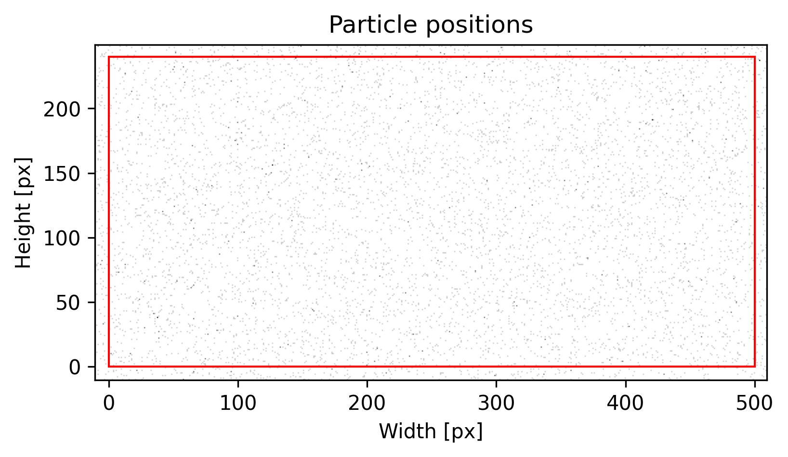
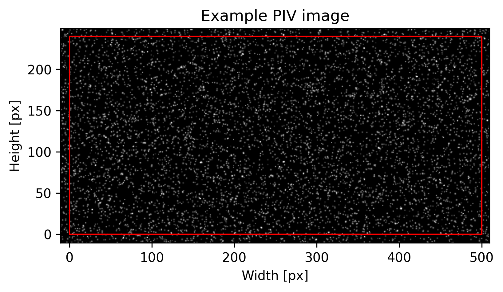

######################################
Generate synthetic images
######################################

Minimal working example:

.. code:: python

    from pypiv import Particle, Image

Define image sizes in pixels:

.. code:: python

    image_size = (128,128)

Instantiate an object of the ``Particle`` class that defines particles with specific properties, and seed the particles randomly:

.. code:: python

    particles = Particle(1,
                         size=image_size,
                         densities=(0.01,0.05),
                         diameters=(3,6),
                         distances=(1,1),
                         seeding_mode='random',
                         random_seed=100)

Instantiate an object of the ``Image`` class that defines the image space:

.. code:: python

    image = Image(size=image_size,
                  random_seed=100)

Add particles to the image:

.. code:: python

    image.add_particles(particles)

If we plot the image at this stage, we will only see the particle positions (centroids):

.. code:: python

    image.plot(0,
               xlabel='Width [px]',
               ylabel='Height [px]',
               title='Particle positions',
               cmap='Reds',
               figsize=(6,6),
               filename='particle-positions.png');

We can now add laser light reflected from the particles:

.. code:: python

    image.add_reflected_light(exposures=(0.02,0.8),
                              maximum_intensity=2**16-1,
                              laser_beam_thickness=2,
                              laser_over_exposure=1,
                              laser_beam_shape=0.15,
                              alpha=1)

Which produces the PIV image:

.. code:: python

    image.plot(0,
               xlabel='Width [px]',
               ylabel='Height [px]',
               title='Example PIV image',
               cmap='Greys_r',
               figsize=(5,4),
               filename='example-image.png');

