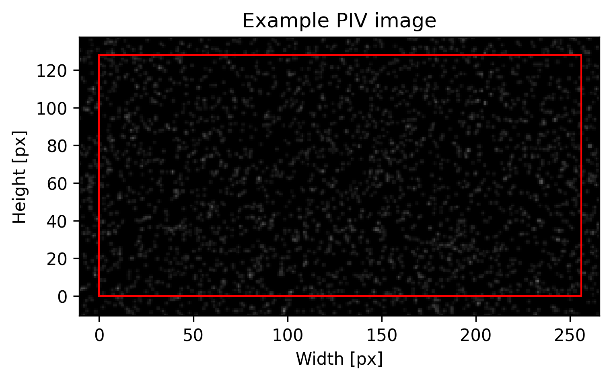
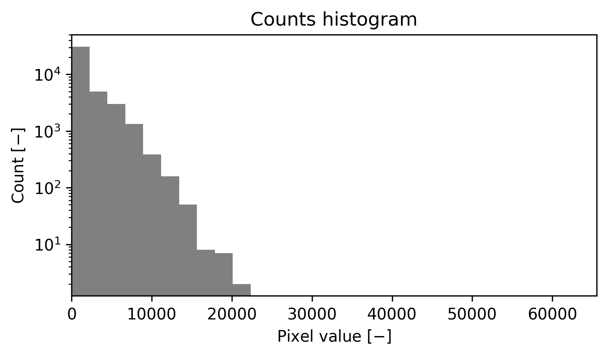
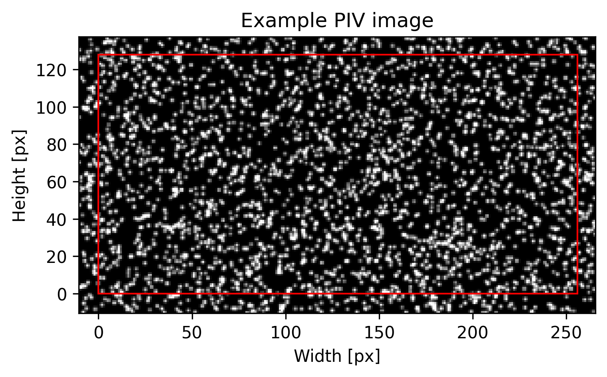
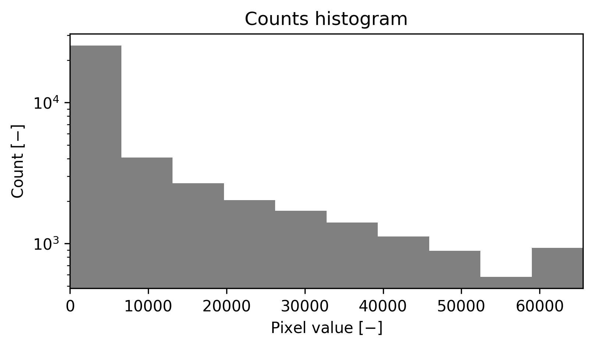

######################################
Image statistics
######################################

.. code:: python

    import numpy as np
    from pykitPIV import Particle, Image

************************************************************
Generate particles
************************************************************

.. code:: python

    n_images = 1
    image_size = (128,256)
    size_buffer = 10
    figsize = (6,3)

.. code:: python

    particles = Particle(n_images,
                         size=image_size,
                         size_buffer=size_buffer,
                         diameters=(3,3.1),
                         distances=(1,2),
                         densities=(0.05,0.1),
                         signal_to_noise=(5,20),
                         diameter_std=0.2,
                         seeding_mode='random',
                         random_seed=100)

.. code:: python

    image = Image(random_seed=100)

We add the generated particles to the image:

.. code:: python

    image.add_particles(particles)

************************************************************
Explore image statistics
************************************************************

Statistics of low-exposure images
============================================

.. code:: python

    exposures = (0.1, 0.15)

.. code:: python

    image.add_reflected_light(exposures=exposures,
                              maximum_intensity=2**16-1,
                              laser_beam_thickness=1,
                              laser_over_exposure=1,
                              laser_beam_shape=0.95,
                              alpha=1/10)

.. code:: python

    image.plot(0,
               with_buffer=True,
               xlabel='Width [px]',
               ylabel='Height [px]',
               title='Example PIV image',
               cmap='Greys_r',
               figsize=figsize,
               filename='example-image-low-exposure.png');

.. code:: python

    image.plot_image_histogram(image.images_I1[0],
                               logscale=True,
                               color='grey',
                               xlabel='Pixel value [$-$]',
                               ylabel='Count [$-$]',
                               title='Counts histogram',
                               figsize=figsize,
                               filename='counts-histogram-low-exposure.png');

Statistics of high-exposure images
============================================

.. code:: python

    exposures = (0.9, 0.95)

.. code:: python

    image.add_reflected_light(exposures=exposures,
                              maximum_intensity=2**16-1,
                              laser_beam_thickness=1,
                              laser_over_exposure=1,
                              laser_beam_shape=0.95,
                              alpha=1/10)

.. code:: python

    image.plot(0,
               with_buffer=True,
               xlabel='Width [px]',
               ylabel='Height [px]',
               title='Example PIV image',
               cmap='Greys_r',
               figsize=figsize,
               filename='example-image-high-exposure.png');

.. code:: python

    image.plot_image_histogram(image.images_I1[0],
                               logscale=True,
                               color='grey',
                               xlabel='Pixel value [$-$]',
                               ylabel='Count [$-$]',
                               title='Counts histogram',
                               figsize=figsize,
                               filename='counts-histogram-high-exposure.png');

