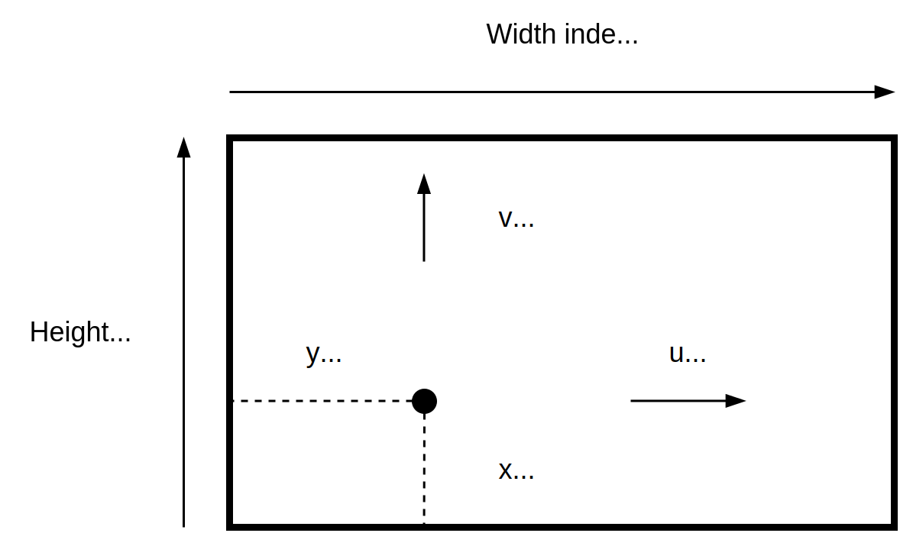

.. module:: image

####################
Class: ``Image``
####################

The following convention for indexing various image-related quantities applies throughout the **pykitPIV** modules:

.. autoclass:: pykitPIV.image.Image

.. autofunction:: pykitPIV.image.Image.add_particles

.. autofunction:: pykitPIV.image.Image.add_flowfield

.. autofunction:: pykitPIV.image.Image.add_motion

.. autofunction:: pykitPIV.image.Image.add_reflected_light

.. autofunction:: pykitPIV.image.Image.compute_light_intensity_at_pixel

.. autofunction:: pykitPIV.image.Image.remove_buffers

.. autofunction:: pykitPIV.image.Image.measure_counts

.. autofunction:: pykitPIV.image.Image.image_pairs_to_tensor

.. autofunction:: pykitPIV.image.Image.targets_to_tensor

.. autofunction:: pykitPIV.image.Image.save_to_h5

.. autofunction:: pykitPIV.image.Image.upload_from_h5

.. autofunction:: pykitPIV.image.Image.plot

.. autofunction:: pykitPIV.image.Image.plot_image_pair

.. autofunction:: pykitPIV.image.Image.plot_velocity_field

.. autofunction:: pykitPIV.image.Image.plot_velocity_field_magnitude

.. autofunction:: pykitPIV.image.Image.plot_image_histogram